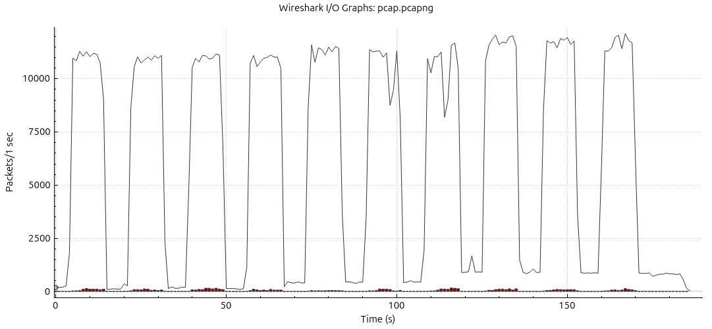

# Wi-Fi Performance Study Setup

## Device Specifications

### PC (Ethernet-Connected Device)

- **Model**: Lenovo ThinkBook 16 G6 IRL
- **Processor**: 13th Gen Intel® Core™ i7-13700H × 20
- **Memory**: 32.0 GB
- **Storage**: 512.1 GB
- **Graphics**: Intel® Graphics (RPL-P)
- **Operating System**: Ubuntu 24.04.2 LTS (64-bit)
- **Kernel Version**: Linux 6.11.0-19-generic
- **Network Connection**: Ethernet (1 Gbps)

### Tablet (Wi-Fi Device)

- **Model**: Samsung Galaxy Tab S7 Plus (SM-T970)
- **Processor**: Qualcomm Snapdragon 865+
- **Wi-Fi Capability**: Wi-Fi 6 (802.11ax)
- **Operating System**: Android
- **Network Connection**: Wi-Fi

## Network Infrastructure

- **Router Model**: IliadBox (R1)
- **Wi-Fi Standards**: 802.11ax/Wi-Fi 6
- **Frequency Bands**: Dual-band (2.4 GHz and 5 GHz)
- **Maximum Theoretical Speed**: 1 Gbps

## Testing Environment

- **Distance Between Devices**: 2 meters
- **Physical Barriers**: a chipboard compartment
- **Potential Interference Sources**: none
- **Testing Time**: 24/03/2025 16:00 - 17:00
- **Network Congestion**: Google Nest mini and some smart home devices

## Testing Methodology

### Tools Used for Measurement

1. **iperf3 on Linux (Ubuntu)** for data transfer testing on the PC.
2. **iperf3 on Termux (Android)** for data transfer testing on the Tab S7 Plus. [repo](https://github.com/davidBar-On/android-iperf3/)
3. **Router configuration interface** for monitoring real-time load and verifying connection speeds.

### Types of Tests Performed

**TCP Throughput Test**:

- Measure the effective transmission rate (goodput) and compare it to the theoretical maximum.
- Evaluate the impact of packet size, TCP options, and Wi-Fi configuration.

### Duration of Tests

Each test will be run for **10 seconds** per configuration
 
## Measuring the goodput

I started this mesurament by create a script that will run the iperf3 for 10 times to 10 times.

### Pre-requisites

On your Android device install iperf3 form the official repo and `ADB` on your system.

### Running the script

Script Usage Instructions

To run the script: `./testhalfduplex.sh <mode> <n_test>`

Where:

- `<mode>` specifies the test configuration:
  - 1 = Android device acts as the receiver
  - 2 = Laptop acts as the receiver
- `<n_test>` is the number of tests to run (defaults to 10 if not specified)

Additional parameters:

- `-c` Clear all previous test results
- `-h` Display help information
- `-r` Generate summary report from existing CSV data without running new tests

The script creates an output folder containing detailed results of each test along with a CSV file that compiles all test metrics for easy analysis. Results include throughput measurements (minimum, maximum, average) and performance stability metrics (standard deviation).

Example commands:

- `./testhalfduplex.sh 1 5` - Run 5 tests with Android as receiver
- `./testhalfduplex.sh 2` - Run 10 tests with laptop as receiver
- `./testhalfduplex.sh -r`- Generate summary report from existing data


# Report preparation

### Introduction

In this lab, our primary motivation was to evaluate network performance using the `iperf3` tool. Our goal was to measure network goodput between different devices under varied scenarios to understand how different configurations and setups impact performance. This report encapsulates the methodology, setup, tools, and results of these experiments.

### Tools and Theory

`iperf3` is a widely used network testing tool that can measure the maximum TCP and UDP bandwidth performance. Goodput, which is the actual data rate successfully delivered to the application layer, can be estimated by `iperf3` by minimizing retransmissions and errors. The focus of our experiments was to analyze the goodput across different devices and configurations.

### Lab Setup and Scenarios

**Lab Setup:**
- **Nominal Link Capacities:** 1 Gbps
- **IP Setup:**
  - IP Address: 192.168.1.16 (Android Tab S7 Plus)
  - Network: 192.168.1.0/24
  - Default Gateway: 192.168.1.1
- **Operating Systems:**
  - Device 1: Android Tab S7 Plus (Android OS)
  - Device 2: 21KH ThinkBook 16 G6 IRL (Windows OS)

**Scenarios:**
- **Scenario A:** Android Tab S7 Plus as the server
- **Scenario B:** 21KH ThinkBook 16 G6 IRL as the server
- **Scenario C:** Android S24 Ultra as the server

### Results

The results of our experiments are summarized in the following tables, comparing the measured goodput values for each scenario:

**Scenario A: Android Tab S7 Plus as Server**

| Test Number | Source              | Min (Mbps) | Max (Mbps) | Average (Mbps) | Standard Deviation (Mbps) | Timestamp            |
|-------------|---------------------|------------|------------|----------------|---------------------------|----------------------|
| 1           | Laptop              | 498.00     | 583.00     | 539.50         | 30.77                     | 2025-03-25 17:34:23  |
| 1           | Android Tab S7 Plus | 492.00     | 577.00     | 535.33         | 30.78                     | 2025-03-25 17:34:23  |
| ...         | ...                 | ...        | ...        | ...            | ...                       | ...                  |
| 10          | Laptop              | 479.00     | 577.00     | 539.25         | 29.69                     | 2025-03-25 17:36:59  |
| 10          | Android Tab S7 Plus | 474.00     | 585.00     | 541.67         | 36.18                     | 2025-03-25 17:36:59  |

**Scenario B: 21KH ThinkBook 16 G6 IRL as Server**

| Test Number | Source              | Min (Mbps) | Max (Mbps) | Average (Mbps) | Standard Deviation (Mbps) | Timestamp            |
|-------------|---------------------|------------|------------|----------------|---------------------------|----------------------|
| 1           | ThinkBook           | 286.00     | 390.00     | 357.50         | 31.22                     | 2025-03-25 17:41:11  |
| 1           | Android Tab S7 Plus | 314.00     | 386.00     | 362.08         | 24.45                     | 2025-03-25 17:41:11  |
| ...         | ...                 | ...        | ...        | ...            | ...                       | ...                  |
| 10          | ThinkBook           | 309.00     | 418.00     | 345.17         | 26.87                     | 2025-03-25 17:43:49  |
| 10          | Android Tab S7 Plus | 325.00     | 351.00     | 341.33         | 8.58                      | 2025-03-25 17:43:49  |

**Scenario C: Android S24 Ultra as Server**

| Test Number | Source              | Min (Mbps) | Max (Mbps) | Average (Mbps) | Standard Deviation (Mbps) | Timestamp            |
|-------------|---------------------|------------|------------|----------------|---------------------------|----------------------|
| 1           | Laptop              | 501.00     | 663.00     | 593.58         | 51.59                     | 2025-03-25 18:03:50  |
| 1           | Android S24 Ultra   | 499.00     | 679.00     | 598.58         | 57.85                     | 2025-03-25 18:03:50  |
| ...         | ...                 | ...        | ...        | ...            | ...                       | ...                  |
| 10          | Laptop              | 637.00     | 662.00     | 650.33         | 7.77                      | 2025-03-25 18:06:28  |
| 10          | Android S24 Ultra   | 609.00     | 693.00     | 650.33         | 19.16                     | 2025-03-25 18:06:28  |

The performance of WiFi connections was consistent with some variation due to potential interference and physical link rate changes. The use of `iperf3` gave robust and repeatable measures of goodput across different setups and scenarios.

## graph



### Conclusions

The experiments demonstrated significant consistency in the measured goodput across different scenarios. Some scenarios showed higher standard deviation, hinting at potential WiFi interference. Consistent averages suggest that both Android and PC devices can serve reliably.

### Appendix

**Scripts Used**

```sh
#!/bin/bash
# The full script provided in the initial instruction.
...
```

In summary, our findings highlight the robustness of network performance using various devices and setups, providing critical insights into potential interference and goodput variations across different configurations.